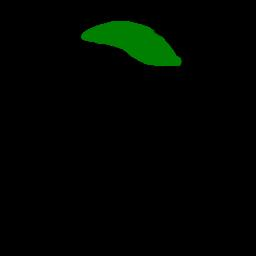

<h2>Tensorflow-Image-Segmentation-Liver-Tumor (2024/10/30)</h2>

This is the second experiment for Liver-Tumor Segmentation based on the latest 
<a href="https://github.com/sarah-antillia/Tensorflow-Image-Segmentation-API">Tensorflow-Image-Segmentation-API</a>, and
<a href="https://drive.google.com/file/d/1TlPpuBz8K-cdyVD2sRdfEwjGac_55z1w/view?usp=sharing">
Liver-Tumor-ImageMask-Dataset.zip</a>, which was derived by us from the following kaggle web site.

<a href="https://www.kaggle.com/datasets/prathamgrover/3d-liver-segmentation">
3D Liver segmentation</a>
 
 
On detail of our Liver Tumor ImageMask Dataset, please refer to our first experiment  
<a href="https://github.com/sarah-antillia/Image-Segmentation-Liver-Tumor">Image-Segmentatioin-Liver-Tumor</a>
 
 

<b>Actual Image Segmentation for Images of 256x256 pixels</b> 
As shown below, the inferred masks look similar to the ground truth masks.  

<table>
<tr>
<th>Input: image</th>
<th>Mask (ground_truth)</th>
<th>Prediction: inferred_mask</th>
</tr>
<tr>
<td></td>
<td></td>
<td></td>
</tr>

<tr>
<td></td>
<td></td>
<td></td>
</tr>

<tr>
<td></td>
<td></td>
<td></td>
</tr>

</table>

We used the simple UNet Model <a href="./src/TensorflowUNet.py">TensorflowSlightlyFlexibleUNet</a> for this Follicular-Cell Segmentation. 
As shown in <a href="https://github.com/sarah-antillia/Tensorflow-Image-Segmentation-API">Tensorflow-Image-Segmentation-API</a>.
you may try other Tensorflow UNet Models: 

<li><a href="./src/TensorflowSwinUNet.py">TensorflowSwinUNet.py</a></li>
<li><a href="./src/TensorflowMultiResUNet.py">TensorflowMultiResUNet.py</a></li>
<li><a href="./src/TensorflowAttentionUNet.py">TensorflowAttentionUNet.py</a></li>
<li><a href="./src/TensorflowEfficientUNet.py">TensorflowEfficientUNet.py</a></li>
<li><a href="./src/TensorflowUNet3Plus.py">TensorflowUNet3Plus.py</a></li>
<li><a href="./src/TensorflowDeepLabV3Plus.py">TensorflowDeepLabV3Plus.py</a></li>
 

<h3>1. Dataset Citation</h3>
The image dataset used here has been taken from the following kaggle web site.

<a href="https://www.kaggle.com/datasets/prathamgrover/3d-liver-segmentation">
3D Liver segmentation</a>
 
<b>About Dataset</b> 
Use this dataset for segmenting the liver tumor in 3D scans. The imagesTr files contains nifti   
images which are input for this image. Each nifti image contains multiple 2D slices of a single scan. 
labelsTr contains the output for the corresponding input specifying where the tumor is localised. 
 
<b>License</b> 
<a href="https://opendatacommons.org/licenses/dbcl/1-0/">
Open Data Commons
</a>

 
 

<h3>
<a id="2">
2 Liver-Tumor ImageMask Dataset
</a>
</h3>
 If you would like to train this Liver-Tumor Segmentation model by yourself,
 please download our Liver-Tumor dataset from the google drive 
<a href="https://drive.google.com/file/d/1TlPpuBz8K-cdyVD2sRdfEwjGac_55z1w/view?usp=sharing">
Liver-Tumor-ImageMask-Dataset.zip</a>, 
 expand the downloaded dataset and put it under <b>./dataset</b> folder to be

<pre>
./dataset
└─Liver-Tumor
    ├─test
    │  ├─images
    │  └─masks
    ├─train
    │  ├─images
    │  └─masks
    └─valid
        ├─images
        └─masks
</pre>
 
 
<b>Liver-Tumor Statistics</b> 
 

As shown above, the number of images of train and valid dataset is enough to use for our segmentation model.

 
 
<b>Train_images_sample</b> 

 
<b>Train_masks_sample</b> 

 

<h3>
3. Train Tensorflow UNet Model
</h3>
 We trained Liver Tumor TensorflowUNet Model by using the configuration file
<a href="./projects/TensorflowSlightlyFlexibleUNet/Liver-Tumor/train_eval_infer.config"> <b>train_eval_infer.config</b></a> file.  
Please move to ./projects/TensorflowSlightlyFlexibleUNet/Liver-Tumor and run the following bat file. 
<pre>
>1.train.bat
</pre>
, which simply runs the following command. 
<pre>
>python ../../../src/TensorflowUNetTrainer.py ./train_eval_infer.config
</pre>

<b>Model parameters</b> 
Defined a small <b>base_filters</b> and a small <b>base_kernels</b> for the first Conv Layer of Encoder Block of 
<a href="./src/TensorflowUNet.py">TensorflowUNet.py</a> 
and a large num_layers (including a bridge between Encoder and Decoder Blocks).
<pre>
[model]
model          = "TensorflowUNet"
image_width    = 256
image_height   = 256
image_channels = 3
base_filters   = 16
base_kernels   = (3,3)
num_layers     = 8
dilation       = (1,1)
</pre>

<b>Learning rate</b> 
Defined a small learning rate.  
<pre>
[model]
learning_rate  = 0.0001
</pre>

<b>Online augmentation</b> 
Diabled our online augmentation. To enable it, set the generator to be True.
<pre>
[model]
model         = "TensorflowUNet"
generator     = False
</pre>

<b>Loss and metrics functions</b> 
Specified "bce_dice_loss" and "dice_coef". 
<pre>
[model]
loss           = "bce_dice_loss"
metrics        = ["dice_coef"]
</pre>
<b>Learning rate reducer callback</b> 
Enabled learing_rate_reducer callback with a small reducer_patience.
<pre> 
[train]
learning_rate_reducer = True
reducer_factor     = 0.4
reducer_patience   = 4
</pre>

<b>Early stopping callback</b> 
Enabled an early stopping callback with patience parameter.
<pre>
[train]
patience      = 10
</pre>

<b>Mask blurring and binarization</b> 
Enabled mask blurring and binarization.
<pre>
[mask]
blur      = True
blur_size = (3,3)
binarize  = True
threshold = 74

</pre>

<b>Epoch change inference callbacks</b> 
Enabled epoch_change_infer and epoch_change_tiledinfer callbacks. 
<pre>
[train]
epoch_change_infer      = True
epoch_change_infer_dir  = "./epoch_change_infer"
epoch_change_tiledinfer = False
epoch_change_tiledinfer_dir = "./epoch_change_tiledinfer"
num_infer_images        = 6
</pre>

By using these callbacks, on every epoch_change, the inference procedures can be called
 for 6 images in <b>mini_test</b> folder. These will help you confirm how the predicted mask changes 
 at each epoch during your training process.    

<b>Epoch_change_inference output</b> 
 
 
 
In this experiment, the training process was terminated at epoch 100.  
 
 
 
<a href="./projects/TensorflowSlightlyFlexibleUNet/Liver-Tumor/eval/train_metrics.csv">train_metrics.csv</a> 
 

 
<a href="./projects/TensorflowSlightlyFlexibleUNet/Liver-Tumor/eval/train_losses.csv">train_losses.csv</a> 
 
 

<h3>
4.Evaluation
</h3>
Please move to a <b>./projects/TensorflowSlightlyFlexibleUNet/Liver-Tumor</b> folder, 
and run the following bat file to evaluate TensorflowUNet model for Liver-Tumor. 
<pre>
./2.evaluate.bat
</pre>
<pre>
python ../../../src/TensorflowUNetEvaluator.py ./train_eval_infer_aug.config
</pre>
Evaluation console output: 

  
The loss (bce_dice_loss) to this Liver-Tumor test dataset was very low, and dice_coef very high as shown below.
 
<pre>
loss,0.0203
dice_coef,0.9717
</pre>
 

<h2>
5. Inference
</h2>
Please move to a <b>./projects/TensorflowSlightlyFlexibleUNet/Augmented-Follicular-Cell</b> folder 
,and run the following bat file to infer segmentation regions for images by the Trained-TensorflowUNet model for Follicular-Cell. 
<pre>
./3.infer.bat
</pre>
<pre>
python ../../../src/TensorflowUNetInferencer.py ./train_eval_infer_aug.config
</pre>
Sample test images 
 
Sample test mask (ground_truth) 
 

 
Inferred test masks 
 
 

<b>Enlarged images and masks of 256x256</b> 

<table>
<tr>
<th>Image</th>
<th>Mask (ground_truth)</th>
<th>Inferred-mask</th>
</tr>

<tr>
<td></td>
<td></td>
<td></td>
</tr>

<tr>
<td></td>
<td></td>
<td></td>
</tr>

<tr>
<td></td>
<td></td>
<td></td>
</tr>

<tr>
<td></td>
<td></td>
<td></td>
</tr>
<tr>
<td></td>
<td></td>
<td></td>
</tr>
<tr>
<td></td>
<td></td>
<td></td>
</tr>
</table>

 
 
<h3>
References
</h3>
<b>1. 3D Liver segmentation</b> 
<a href="https://www.kaggle.com/datasets/prathamgrover/3d-liver-segmentation/code">
https://www.kaggle.com/datasets/prathamgrover/3d-liver-segmentation/code
</a>
 
 

<b>2. 3D liver unet</b> 
<a href="https://www.kaggle.com/code/prathamgrover/3d-liver-unet">
https://www.kaggle.com/code/prathamgrover/3d-liver-unet
</a>
 
 

<b>3. Liver segmentation 3D-IRCADb-01</b> 
<a href="https://www.ircad.fr/research/data-sets/liver-segmentation-3d-ircadb-01/">
https://www.ircad.fr/research/data-sets/liver-segmentation-3d-ircadb-01/
</a>
 
 

<b>4. Image-Segmentation-Liver-Tumor</b> 
Toshiyuki Arai @antillia.com 
<a href="https://github.com/sarah-antillia/Image-Segmentation-Liver-Tumor">
https://github.com/sarah-antillia/Image-Segmentation-Liver-Tumor
</a>
